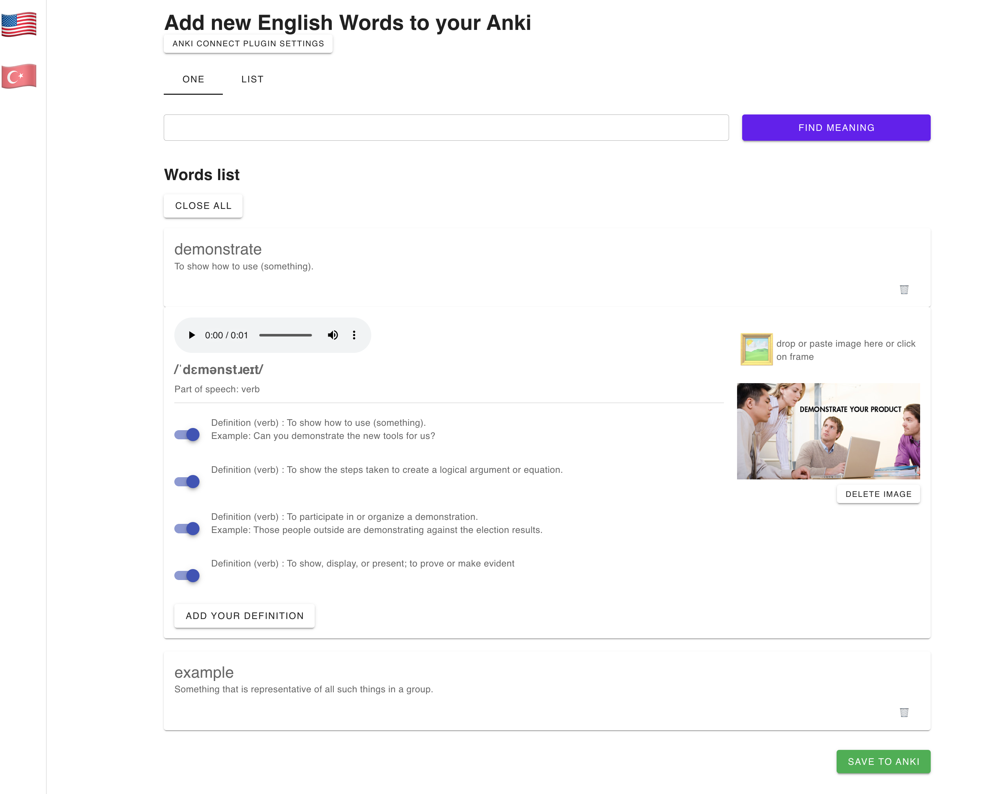

# words-meaning-anki

Приложения для изучение новых слов с помощью [Anki](https://apps.ankiweb.net/).
Для возможности **сохранения карточек** в ваш словарь, установите десктопную версию Anki и поставьте расширение [Anki-connect](https://github.com/FooSoft/anki-connect).
Можно пропустить этот шаг если вы хотите только посмотреть на приложение вживую, без использования его по  назначению.

### API
Для поиска новых слов используются словари: 
- [linguarobot](https://www.linguarobot.io/)
- [dictionaryapi](https://dictionaryapi.dev/)

Linguarobot не работает без API_KEY, чтобы добавить его в приложение, создайте в корне проекта файл `.env.local` и добавьте переменную:
```sh
VITE_APP_LINGUA_ROBOT_API_KEY=YOUR_API_KEY
```
Можете связаться со мной если у вас нет возможности получить новый API_KEY.

### UI 



## Project Setup

```sh
npm install
```

### Compile and Hot-Reload for Development

```sh
npm run dev
```

### Type-Check, Compile and Minify for Production

```sh
npm run build
```

### Lint with [ESLint](https://eslint.org/)

```sh
npm run lint
```

### Format code with [Prettier](https://prettier.io/)

```sh
npm run format
```